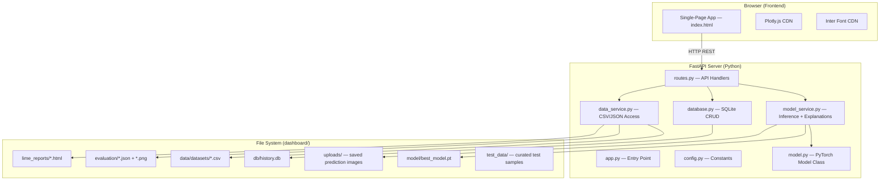
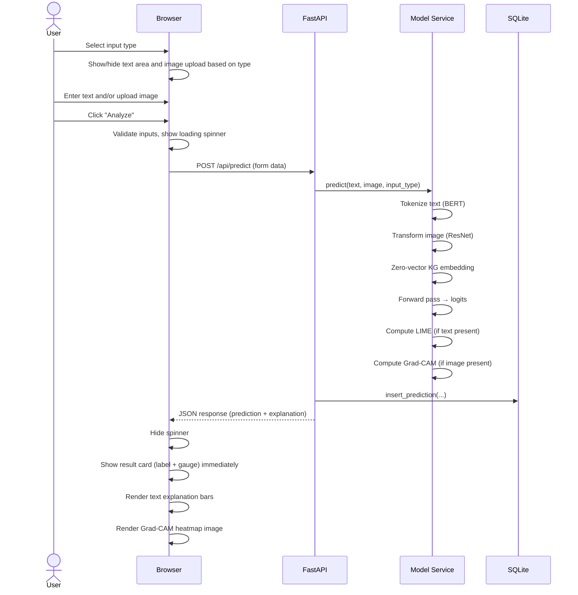

# Veracity AI — Design Document

> **Version**: 2.0  
> **Last Updated**: 2026-04-07  
> **Status**: Awaiting user approval  
> **Document Purpose**: Define the system ARCHITECTURE, component layout, UI/UX design, and folder structure.  
> **Refs**: [01_requirements.md](./01_requirements.md), [02_spec.md](./02_spec.md)

---

## 1. System Architecture



**Flow summary**:
1. Browser loads `index.html` from FastAPI static mount
2. Client-side JS router renders pages based on URL hash
3. Pages fetch data from `/api/*` endpoints via `fetch()`
4. Backend loads model once at startup; serves predictions synchronously
5. Explanations computed inline (same request); result sent first visually, explanations populate async on frontend
6. All predictions saved to SQLite; uploaded images saved to `uploads/`

---

## 2. Backend Component Design

| File | Responsibility | Key Functions |
|---|---|---|
| `app.py` | FastAPI app creation, startup event, middleware, mounts | `lifespan()`, creates app |
| `config.py` | Path constants, model config | `BASE_DIR`, `MODEL_PATH`, `DB_PATH`, etc. |
| `routes.py` | All 13 API endpoint handlers | One function per endpoint |
| `model.py` | `UnifiedMultimodalFakeNewsDetector` PyTorch class | Extracted verbatim from notebook |
| `model_service.py` | Model loading, text/image preprocessing, inference, LIME, Grad-CAM | `load_model()`, `predict()`, `explain_text()`, `explain_image()` |
| `database.py` | SQLite async operations | `init_db()`, `insert_prediction()`, `get_history()`, `delete_prediction()` |
| `data_service.py` | CSV DataFrame loading + caching, JSON file reading, pagination | `get_gossipcop()`, `get_weibo()`, `get_dataset_stats()` |

### Startup sequence:
1. `app.py lifespan()` → call `model_service.load_model()` → loads `best_model.pt` into memory
2. `app.py lifespan()` → call `database.init_db()` → creates SQLite table if not exists
3. `app.py lifespan()` → call `data_service.load_dataframes()` → caches GossipCop + Weibo CSVs in memory
4. Static files mounted: `/static` → `static/`, images via API
5. Templates mounted: Jinja2 for `index.html`

---

## 3. Frontend Component Design

| File | Responsibility |
|---|---|
| `templates/index.html` | SPA shell: top bar, sidebar, content area, footer, CDN imports |
| `static/css/style.css` | Complete design system: CSS variables, components, themes, layout |
| `static/js/app.js` | App init, sidebar toggle handler |
| `static/js/router.js` | Hash-based client-side router — maps `#/page` to page render functions |
| `static/js/theme.js` | Dark/light toggle, localStorage persistence, CSS class toggle |
| `static/js/api.js` | Fetch wrapper: `api.get()`, `api.post()`, `api.postForm()`, `api.delete()` |
| `static/js/charts.js` | Plotly.js helpers: dark/light theme configs, common layout options |
| `static/js/pages/overview.js` | KPI cards, training curves chart, model summary |
| `static/js/pages/predict.js` | Input type selector, text area, image upload, result display, explanations |
| `static/js/pages/batch.js` | CSV upload, language dropdown, results table, summary cards |
| `static/js/pages/history.js` | Paginated history table, delete buttons |
| `static/js/pages/evaluation.js` | Metrics table, comparison bar chart, confusion matrix, ROC |
| `static/js/pages/adversarial.js` | Clean/FGSM/PGD bar chart, attack explanations |
| `static/js/pages/explainability.js` | LIME gallery grid, SHAP image display, modal viewer |
| `static/js/pages/dataset.js` | Tab toggle, label filter, data cards, donut chart, pagination |
| `static/js/pages/training.js` | Loss/accuracy chart, best epoch annotation, log viewer |

### Client-side routing table:

| Hash | Page Module | Sidebar Label | Icon |
|---|---|---|---|
| `#/` or `#/overview` | `overview.js` | Overview | 🏠 |
| `#/predict` | `predict.js` | Predict | 🔮 |
| `#/batch` | `batch.js` | Batch | 📦 |
| `#/history` | `history.js` | History | 📜 |
| `#/evaluation` | `evaluation.js` | Evaluation | 📊 |
| `#/adversarial` | `adversarial.js` | Adversarial | 🛡️ |
| `#/explainability` | `explainability.js` | XAI | 🔍 |
| `#/dataset` | `dataset.js` | Datasets | 📁 |
| `#/training` | `training.js` | Training | 📈 |

---

## 4. UI/UX Design

### 4.1 Layout
```
┌──────────────────────────────────────────────────────────┐
│  ☰  VERACITY AI                         🌙/☀️ Toggle   │  ← Top Bar (56px)
├───────────┬──────────────────────────────────────────────┤
│           │                                              │
│  🏠 Over. │                                              │
│  🔮 Pred. │          MAIN CONTENT AREA                   │
│  📦 Batch │      (page component renders here)           │
│  📜 Hist. │                                              │
│  📊 Eval  │            #page-content                     │
│  🛡️ Adver.│                                              │
│  🔍 XAI   │                                              │
│  📁 Data  │                                              │
│  📈 Train │                                              │
│           │                                              │
│  [Collapse│                                              │
│   Sidebar]│                                              │
├───────────┴──────────────────────────────────────────────┤
│  © 2026 Veracity AI                                      │  ← Footer (40px)
└──────────────────────────────────────────────────────────┘
```

- Sidebar width: 240px (expanded), 0px (collapsed)
- Content area: `calc(100% - 240px)` or `100%` when collapsed
- Transition: `width 0.3s ease, margin-left 0.3s ease`

### 4.2 Color System

**Dark Mode (default)**:

| Token | Value | Usage |
|---|---|---|
| `--bg-primary` | `#0a0e1a` | Page background |
| `--bg-secondary` | `#111827` | Card backgrounds |
| `--bg-tertiary` | `#1e293b` | Sidebar, inputs, table headers |
| `--bg-glass` | `rgba(17, 24, 39, 0.7)` | Glassmorphism panels |
| `--text-primary` | `#f1f5f9` | Main text color |
| `--text-secondary` | `#94a3b8` | Muted/secondary text |
| `--text-muted` | `#64748b` | Disabled/hint text |
| `--accent` | `#6c63ff` | Primary accent |
| `--accent-hover` | `#5b54e0` | Accent hover state |
| `--accent-gradient` | `linear-gradient(135deg, #6c63ff, #3b82f6)` | Buttons, active indicators |
| `--success` | `#10b981` | Real label, positive values |
| `--danger` | `#ef4444` | Fake label, negative values |
| `--warning` | `#f59e0b` | Warnings, cautions |
| `--border` | `rgba(148, 163, 184, 0.1)` | Card/input borders |
| `--shadow` | `0 4px 24px rgba(0, 0, 0, 0.3)` | Card shadows |

**Light Mode** (applied via `body.light-mode` class):

| Token | Value |
|---|---|
| `--bg-primary` | `#f8fafc` |
| `--bg-secondary` | `#ffffff` |
| `--bg-tertiary` | `#f1f5f9` |
| `--bg-glass` | `rgba(255, 255, 255, 0.7)` |
| `--text-primary` | `#0f172a` |
| `--text-secondary` | `#64748b` |
| `--text-muted` | `#94a3b8` |
| `--border` | `rgba(15, 23, 42, 0.1)` |
| `--shadow` | `0 4px 24px rgba(0, 0, 0, 0.08)` |

Accent colors (`--accent`, `--success`, `--danger`, `--warning`) remain the SAME in both themes.

### 4.3 Typography

```css
--font-family: 'Inter', system-ui, -apple-system, sans-serif;
--text-xs: 0.75rem;    /* 12px */
--text-sm: 0.875rem;   /* 14px */
--text-base: 1rem;     /* 16px */
--text-lg: 1.125rem;   /* 18px */
--text-xl: 1.25rem;    /* 20px */
--text-2xl: 1.5rem;    /* 24px */
--text-3xl: 2rem;      /* 32px */
```

### 4.4 Component Styles

| Component | Key Properties |
|---|---|
| **Cards** | `background: var(--bg-glass)`, `backdrop-filter: blur(12px)`, `border: 1px solid var(--border)`, `border-radius: 16px`, `padding: 24px` |
| **Buttons (primary)** | `background: var(--accent-gradient)`, `border-radius: 8px`, `padding: 10px 24px`, hover: `transform: scale(1.02)`, active: `scale(0.98)` |
| **Inputs** | `background: var(--bg-tertiary)`, `border: 1px solid var(--border)`, `border-radius: 12px`, focus: `border-color: var(--accent)` with glow |
| **Tables** | Striped rows (`odd: bg-tertiary`), hover highlight, sticky header, rounded container |
| **Badges** | `Real` = green bg, `Fake` = red bg, pill shape, small bold text |
| **Gauge** | SVG circle, animated `stroke-dashoffset`, colored by confidence level |
| **Loading** | CSS spinner (rotating border), centered in parent |

---

## 5. Folder Structure

```
dashboard/
│
├── app.py                              # FastAPI entry point + lifespan
├── routes.py                           # All API endpoint handlers
├── model.py                            # UnifiedMultimodalFakeNewsDetector class
├── model_service.py                    # Model load, predict, LIME, Grad-CAM
├── database.py                         # SQLite async CRUD
├── data_service.py                     # CSV/JSON data access + caching
├── config.py                           # All path constants
├── requirements.txt                    # Python dependencies
├── README.md                           # Setup & usage guide
│
├── model/
│   └── best_model.pt                   # PyTorch checkpoint (~818 MB)
│
├── data/
│   └── datasets/
│       ├── gossipcop_final.csv         # 12,252 rows
│       └── weibo_final.csv             # 13,272 rows
│   (NO images/ subdirectory — full Weibo images are NOT copied)
│
├── evaluation/
│   ├── evaluation_results_detailed.json
│   ├── evaluation_table.csv
│   ├── adversarial_results.json
│   ├── training_log.json
│   ├── confusion_matrices_all.png
│   ├── roc_curves_all.png
│   ├── shap_summary.png
│   └── training_curves.png
│
├── lime_reports/
│   ├── lime_sample_0.html
│   ├── lime_sample_1.html
│   ├── ... (18 more)
│   └── lime_sample_19.html
│
├── static/
│   ├── css/
│   │   └── style.css
│   └── js/
│       ├── app.js
│       ├── router.js
│       ├── theme.js
│       ├── api.js
│       ├── charts.js
│       └── pages/
│           ├── overview.js
│           ├── predict.js
│           ├── batch.js
│           ├── history.js
│           ├── evaluation.js
│           ├── adversarial.js
│           ├── explainability.js
│           ├── dataset.js
│           └── training.js
│
├── templates/
│   └── index.html                      # SPA shell
│
├── test_data/
│   ├── gossipcop_text_only/
│   │   └── sample.csv                  # 20 rows (id, text, title, description, label)
│   ├── weibo_text_only/
│   │   └── sample.csv                  # 20 rows (tweet_id, tweet_content, label)
│   ├── weibo_image_only/
│   │   ├── real/                       # 5 real-labeled images
│   │   └── fake/                       # 5 fake-labeled images
│   └── weibo_text_image/
│       ├── real/
│       │   ├── data.csv                # 10 rows (text, image_filename)
│       │   └── *.jpg                   # 10 images
│       └── fake/
│           ├── data.csv                # 10 rows (text, image_filename)
│           └── *.jpg                   # 10 images
│
├── db/
│   └── (history.db — auto-created at runtime)
│
└── uploads/
    └── (prediction images saved here at runtime)
```

**Total images in dashboard**: ~30 test images only.  
**Total files estimated**: ~70 (code + assets + test data).

---

## 6. Prediction Page — Detailed Interaction Flow



---

## 7. External Dependencies (CDN)

| Resource | URL |
|---|---|
| Plotly.js | `https://cdn.plot.ly/plotly-latest.min.js` |
| Inter Font | `https://fonts.googleapis.com/css2?family=Inter:wght@300;400;500;600;700&display=swap` |

No npm, no build step, no node_modules. All frontend dependencies loaded via CDN.
